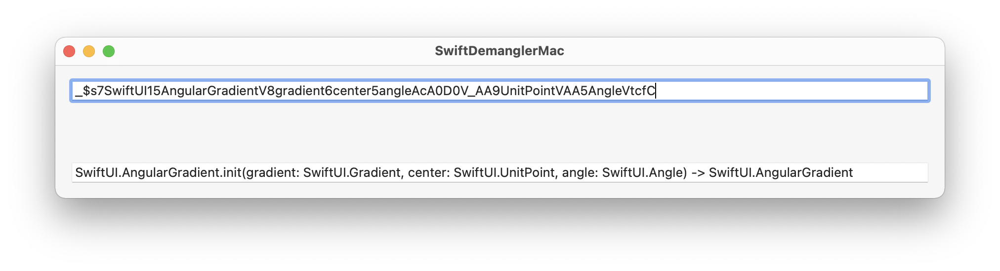

# Swift Demangler UI

Quick and dirty SwiftUI app that's a wrapper around
[CwlDemangle](https://github.com/mattgallagher/CwlDemangle), which is a translation of
Swift's [Demangler.cpp](https://github.com/apple/swift/blob/master/lib/Demangling/Demangler.cpp)
that demangles Swift symbols into their internal formats.

The app provides a text field to enter the raw (mangled) swift symbol, and another to see the results.

